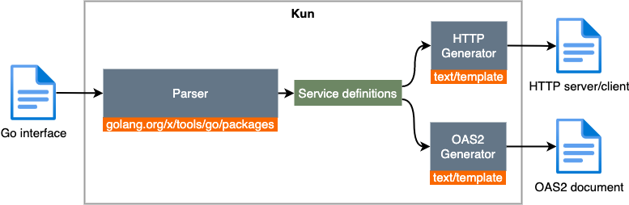
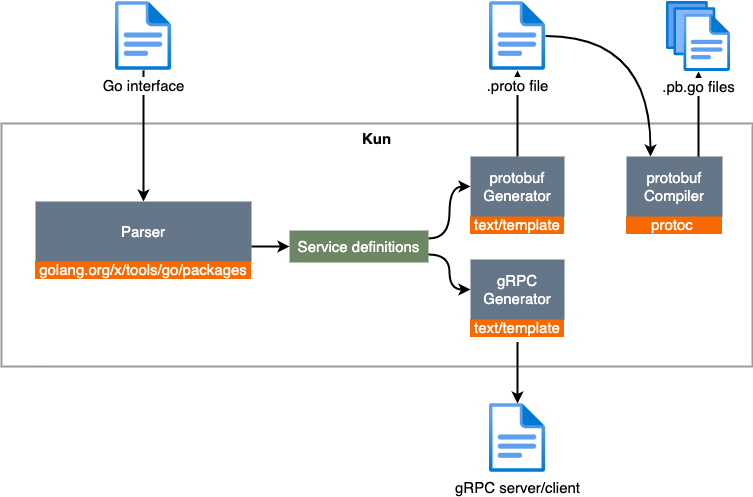

# kun

kun is a communication toolkit for Go services. It concentrates on handling the communications between Go services, to free developers to focus on the business logic.

Ultimately, kun may support the following communication types:

- In-process function call
- RPC (e.g., HTTP and gRPC)
- Asynchronous messaging (not supported yet)

中文博客：[Go 服务通信工具 Kun](http://russellluo.com/2021/12/kun.html)。


## The Zen of kun

- **Focus on the most valuable things**

    Service communication is important, but is less important than the service itself (i.e., your business value).

    Furthermore, it should be effortless to change the communication types.

- **Write code in Go whenever possible**

    Prefer Go to other DSLs (e.g., [OpenAPI](https://spec.openapis.org/oas/latest.html), [Protocol Buffers](https://developers.google.com/protocol-buffers) or [AsyncAPI](https://www.asyncapi.com/)) for service definitions.

- **Maintainability counts**

    Embrace the spirit of [the Clean Architecture][1] for non-trivial applications.


## Features

1. Code Generation Tool

    - [x] HTTP
        + [x] HTTP Server
        + [x] HTTP Client
        + [x] HTTP Test
        + [x] [OAS2][2] Document
    - [x] gRPC
        + [x] Protocol Buffers
        + [x] gRPC Server
        + [ ] gRPC Client

2. Useful Packages

    - [appx](pkg/appx): Application framework for HTTP and CRON applications (a wrapper of [appx][3]).
    - [prometheus](pkg/prometheus): Prometheus metrics utilities.
    - [trace](pkg/trace): A thin wrapper of [x/net/trace][4] for Go kit.
    - [werror](pkg/werror): Classified business errors.


## How it works

### HTTP Generation



### gRPC Generation




## Installation

```bash
$ go install github.com/RussellLuo/kun/cmd/kungen@latest
```

<details open>
  <summary> Usage </summary>

```bash
$ kungen -h
kungen [flags] source-file interface-name
  -flat
    	whether to use flat layout (default true)
  -fmt
    	whether to make code formatted (default true)
  -force
    	whether to remove previously generated files before generating new ones
  -out string
    	output directory (default ".")
  -snake
    	whether to use snake-case for default names (default true)
  -test string
    	the YAML file that provides test-cases for HTTP (default "./http.test.yaml")
  -trace
    	whether to enable tracing
```

</details>


## Quick Start

### HTTP

**NOTE**: The following code is located in [helloworld](examples/helloworld).

1. Define the interface

    ```go
    type Service interface {
        SayHello(ctx context.Context, name string) (message string, err error)
    }
    ```

2. Implement the service

    ```go
    type Greeter struct{}

    func (g *Greeter) SayHello(ctx context.Context, name string) (string, error) {
        return "Hello " + name, nil
    }
    ```

3. Add HTTP annotations

    ```go
    type Service interface {
        //kun:op POST /messages
        SayHello(ctx context.Context, name string) (message string, err error)
    }
    ```

4. Generate the HTTP code

    ```bash
    $ cd examples/helloworld
    $ kungen ./service.go Service
    ```

5. Consume the service

    Run the HTTP server:

    ```bash
    $ go run cmd/main.go
    2020/09/15 18:06:22 transport=HTTP addr=:8080
    ```

    Consume by [HTTPie](https://github.com/jakubroztocil/httpie):

    ```bash
    $ http POST :8080/messages name=Tracey
    HTTP/1.1 200 OK
    Content-Length: 27
    Content-Type: application/json; charset=utf-8
    Date: Tue, 15 Sep 2020 10:06:34 GMT

    {
        "message": "Hello Tracey"
    }
    ```

6. See the OAS documentation

    <details>
      <summary> (Click to expand) </summary>

    ```bash
    $ http GET :8080/api
    HTTP/1.1 200 OK
    Content-Length: 848
    Content-Type: text/plain; charset=utf-8
    Date: Tue, 15 Sep 2020 10:08:24 GMT

    swagger: "2.0"
    info:
      title: "No Title"
      version: "0.0.0"
      description: "Service is used for saying hello."
      license:
        name: "MIT"
    host: "example.com"
    basePath: "/"
    schemes:
      - "https"
    consumes:
      - "application/json"
    produces:
      - "application/json"

    paths:
      /messages:
        post:
          description: "SayHello says hello to the given name."
          operationId: "SayHello"
          parameters:
            - name: body
              in: body
              schema:
                $ref: "#/definitions/SayHelloRequestBody"

          produces:
            - application/json; charset=utf-8
          responses:
            200:
              description: ""
              schema:
                $ref: "#/definitions/SayHelloResponse"


    definitions:
      SayHelloRequestBody:
        type: object
        properties:
          name:
            type: string
      SayHelloResponse:
        type: object
        properties:
          message:
            type: string
    ```

    </details>

### gRPC

**NOTE**: The following code is located in [helloworldgrpc](examples/helloworldgrpc).

1. Define the interface

    ```go
    type Service interface {
        SayHello(ctx context.Context, name string) (message string, err error)
    }
    ```

2. Implement the service

    ```go
    type Greeter struct{}

    func (g *Greeter) SayHello(ctx context.Context, name string) (string, error) {
        return "Hello " + name, nil
    }
    ```

3. Add gRPC annotations

    ```go
    type Service interface {
        //kun:grpc
        SayHello(ctx context.Context, name string) (message string, err error)
    }
    ```

4. Generate the gRPC code

    ```bash
    $ cd examples/helloworldgrpc
    $ kungen ./service.go Service
    ```

5. Consume the service

    Run the gRPC server:

    ```bash
    $ go run cmd/main.go
    2020/09/15 18:06:22 transport=HTTP addr=:8080
    ```

    Consume by [grpcurl](https://github.com/fullstorydev/grpcurl):

    ```bash
    $ grpcurl -plaintext -d '{"name": "Tracey"}' :8080 pb.Service/SayHello
    {
      "message": "Hello Tracey"
    }
    ```

See more examples [here](examples).


## HTTP

### Annotations

#### Define the HTTP request operation

<details open>
  <summary> Directive //kun:op </summary>

##### Syntax

```
//kun:op <method> <pattern>
```

If a Go method needs to correspond to more than one URI (or HTTP method), you can specify multiple `//kun:op` directives, which will produce multiple HTTP request operations.

Note that there are only three possible differences among these HTTP request operations:

- HTTP method
- URI
- Path parameters (defined in URI)

##### Arguments

- **method**: The request method.
- **pattern**: The request URI.
    + NOTE: All variables in **pattern** will automatically be bound to their corresponding method arguments (match by names in *lower camel case*), as **path** parameters, if these variables have not yet been specified explicitly by `//kun:param`.
    
##### Examples

- Single operation:

    ```go
    type Service interface {
        //kun:op DELETE /users/{id}
        DeleteUser(ctx context.Context, id int) (err error)
    }

    // HTTP request:
    // $ http DELETE /users/101
    ```

- Multiple operations:

    ```go
    type Service interface {
        //kun:op GET /messages/{messageID}
        //kun:op GET /users/{userID}/messages/{messageID}
        GetMessage(ctx context.Context, userID string, messageID string) (text string, err error)
    }
  
    // See a runnable example in examples/messaging.

    // HTTP request:
    // $ http GET /messages/123456
    // $ http GET /users/me/messages/123456
    ```

</details>

#### Define the HTTP request parameters

<details open>
  <summary> Directive //kun:param </summary>

##### Syntax

```
//kun:param <argName> [<parameter> [, <parameter2> [, ...]]]
```

If multiple method arguments are involved, you may need to apply multiple bindings. This can be done by adding a new `//kun:param` directive, or by appending the binding to the end of the last `//kun:param` directive in a semicolon-separated list.
  
##### Arguments

- **argName**: The name of the method argument.
    + *Argument aggregation*: By specifying multiple `<parameter>`s in a comma-separated list, multiple request parameters (each one is of basic type or repeated basic type) can be aggregated into one method argument (of any type).
    + *Blank identifier*: By specifying the **argName** with a double underscore prefix `__`, the corresponding request parameter(s) will not be mapped to any method argument. See [here](https://github.com/RussellLuo/kun/issues/15) for more details.
- **parameter**: The definition of a single request parameter, to which the method argument will be mapped.
    + Syntax: `in=<in> name=<name> required=<required> type=<type> descr=<descr>`
    + Options:
        - **in**:
            + **path**: The request parameter is a [path parameter](https://swagger.io/docs/specification/describing-parameters/#path-parameters).
                - Optional: All variables in **pattern** will automatically be bound to their corresponding method arguments (match by names in *lower camel case*), as **path** parameters.
            + **query**: The request parameter is a [query parameter](https://swagger.io/docs/specification/describing-parameters/#query-parameters).
                - To receive values from a multi-valued query parameter, the method argument can be defined as a slice of basic type.
            + **header**: The request parameter is a [header parameter](https://swagger.io/docs/specification/describing-parameters/#header-parameters).
                - To receive values from a multi-valued header parameter, the method argument can be defined as a slice of basic type.
            + **cookie**: The request parameter is a [cookie parameter](https://swagger.io/docs/specification/describing-parameters/#cookie-parameters).
                - Not supported yet.
            + **request**: The request parameter is a property of Go's [http.Request](https://golang.org/pkg/net/http/#Request).
                - This is a special case, and only one property `RemoteAddr` is available now.
                - Note that parameters located in **request** have no relationship with OAS.
        - **name**: The name of the request parameter.
            + Optional: Defaults to **argName** (snake-case, or lower-camel-case if `-snake=false`) if not specified.
        - **required**: Determines whether this parameter is mandatory.
            + Optional: Defaults to `false`, if not specified.
            + If the parameter location is **path**, this property will be set to `true` internally, whether it's specified or not.
        - **type**: The OAS type of the request parameter.
            + Optional: Defaults to the type of the method argument, if not specified.
        - **descr**: The OAS description of the request parameter.
            + Optional: Defaults to `""`, if not specified.
    
##### Examples

- Bind request parameters to simple arguments:

    ```go
    type Service interface {
        //kun:op PUT /users/{id}
        //kun:param name in=header name=X-User-Name
        UpdateUser(ctx context.Context, id int, name string) (err error)
    }

    // HTTP request:
    // $ http PUT /users/101 X-User-Name:tracey
    ```
  
- Bind multiple request parameters to a struct according to tags:

    ```go
    type User struct {
        ID   int    `kun:"in=path"`  // name defaults to snake case `id`
        Name string `kun:"in=query"` // name defaults to snake case `name`
        Age  int    `kun:"in=header name=X-User-Age"`
    }

    type Service interface {
        //kun:op PUT /users/{id}
        //kun:param user
        UpdateUser(ctx context.Context, user User) (err error)
    }

    // HTTP request:
    // $ http PUT /users/101?name=tracey X-User-Age:1
    ```
  
- Bind multiple query parameters to a struct with no tags:

    ```go
    type User struct {
        Name    string   // equivalent to `kun:"in=query name=name"`
        Age     int      // equivalent to `kun:"in=query name=age"`
        Hobbies []string // equivalent to `kun:"in=query name=hobbies"`
    }

    type Service interface {
        //kun:op POST /users
        //kun:param user
        CreateUser(ctx context.Context, user User) (err error)
    }

    // HTTP request:
    // $ http POST /users?name=tracey&age=1&hobbies=music&hobbies=sport
    ```

- Argument aggregation:

    ```go
    type Service interface {
        //kun:op POST /logs
        //kun:param ip in=header name=X-Forwarded-For, in=request name=RemoteAddr
        Log(ctx context.Context, ip net.IP) (err error)
    }

    // The equivalent annotations =>
    // (using backslash-continued annotations)
    type Service interface {
        //kun:op POST /logs
        //kun:param ip in=header name=X-Forwarded-For, \
        //             in=request name=RemoteAddr
        Log(ctx context.Context, ip net.IP) (err error)
    }

    // You must customize the decoding of `ip` later (conventionally in another file named `codec.go`).
    // See a runnable example in examples/usersvc.

    // HTTP request:
    // $ http POST /logs
    ```

- Multiple bindings in a single `//kun:param`:

    ```go
    type Service interface {
        //kun:op POST /users
        //kun:param name; age; ip in=header name=X-Forwarded-For, in=request name=RemoteAddr
        CreateUser(ctx context.Context, name string, age int, ip net.IP) (err error)
    }
  
    // The equivalent annotations =>
    // (using backslash-continued annotations)
  
    type Service interface {
        //kun:op POST /users
        //kun:param name; \
        //          age; \
        //          ip in=header name=X-Forwarded-For, in=request name=RemoteAddr
        CreateUser(ctx context.Context, name string, age int, ip net.IP) (err error)
    }

    // HTTP request:
    // $ http POST /users?name=tracey&age=1
    ```

</details>

#### Define the HTTP request body

<details open>
  <summary> Directive //kun:body </summary>

##### Syntax

```
//kun:body <field>
```

or

```
//kun:body <manipulation> [; <manipulation2> [; ...]]
```

##### Arguments

- **field**: The name of the method argument whose value is mapped to the HTTP request body.
    + Optional: When omitted, a struct containing all the arguments, which are not located in **path**/**query**/**header**, will automatically be mapped to the HTTP request body.
    + The special name `-` can be used, to define that there is no HTTP request body. As a result, every argument, which is not located in **path**/**query**/**header**, will automatically be mapped to one or more query parameters.
- **manipulation**:
    + Syntax: `<argName> name=<name> type=<type> descr=<descr>`
    + Options:
        - **argName**: The name of the method argument to be manipulated.
        - **name**: The name of the request parameter.
            + Optional: Defaults to **argName** (snake-case, or lower-camel-case if `-snake=false`) if not specified.
        - **type**: The OAS type of the request parameter.
            + Optional: Defaults to the type of the method argument, if not specified.
        - **descr**: The OAS description of the request parameter.
            + Optional: Defaults to `""`, if not specified.
    
##### Examples

- Omitted:

    ```go
    type Service interface {
        //kun:op POST /users
        CreateUser(ctx context.Context, name string, age int) (err error)
    }

    // HTTP request:
    // $ http POST /users name=tracey age=1
    ```

- Specified as a normal argument:

    ```go
    type User struct {
        Name string `json:"name"`
        Age  int    `json:"age"`
    }

    type Service interface {
        //kun:op POST /users
        //kun:body user
        CreateUser(ctx context.Context, user User) (err error)
    }

    // HTTP request:
    // $ http POST /users name=tracey age=1
    ```

- Specified as `-`:

    ```go
    type User struct {
        Name    string
        Age     int
        Hobbies []string `kun:"name=hobby"`
    }

    type Service interface {
        //kun:op POST /users
        //kun:body -
        CreateUser(ctx context.Context, user User) (err error)
    }

    // HTTP request:
    // $ http POST /users?name=tracey&age=1&hobby=music&hobby=sport
    ```

- Manipulation:

    ```go
    type Service interface {
        //kun:op POST /users
        //kun:body age name=user_age type=string descr='The user age'
        CreateUser(ctx context.Context, name string, age int) (err error)
    }

    // HTTP request:
    // $ http POST /users name=tracey user_age=1
    ```

</details>

#### Define the success HTTP response

<details open>
  <summary> Directive //kun:success </summary>

##### Syntax

```
//kun:success statusCode=<statusCode> body=<body> manip=`<manipulation> [; <manipulation2> [; ...]]`
```

##### Arguments

- **statusCode**: The status code of the success HTTP response.
    + Optional: Defaults to `200`, if not specified.
- **body**: The name of the response field whose value is mapped to the HTTP response body.
    + Optional: When omitted, a struct containing all the results (except error) will automatically be mapped to the HTTP response body.
- **manipulation**:
    + Syntax: `<argName> name=<name> type=<type> descr=<descr>`
    + Not supported yet.
    
##### Examples

```go
type User struct {
    Name string `json:"name"`
    Age  int    `json:"age"`
}

type Service interface {
    //kun:op POST /users
    //kun:success statusCode=201 body=user
    CreateUser(ctx context.Context) (user User, err error)
}
```

</details>

#### Define the OAS metadata

<details open>
  <summary> Directive //kun:oas </summary>

##### Syntax

```
//kun:oas <property>=<value>
```

##### Arguments

- **property**: The property to set. Supported properties:
    + **docsPath**: The URL path to the OAS documentation itself.
        - Optional: Defaults to `"/api"` if not specified.
    + **title**: The `title` field of Info Object, see [Basic Structure](https://swagger.io/docs/specification/2-0/basic-structure/).
        - Optional: Defaults to `"No Title"` if not specified.
    + **version**: The `version` field of Info Object, see [Basic Structure](https://swagger.io/docs/specification/2-0/basic-structure/).
        - Optional: Defaults to `"0.0.0"` if not specified.
    + **description**: The `description` field of Info Object, see [Basic Structure](https://swagger.io/docs/specification/2-0/basic-structure/).
        - Unavailable: Automatically extracted from the Go documentation of the interface definition.
    + **basePath**: The `basePath` property, see [API Host and Base URL](https://swagger.io/docs/specification/2-0/api-host-and-base-path/).
    + **tags**: A list of tags (comma-separated), see [Grouping Operations With Tags](https://swagger.io/docs/specification/2-0/grouping-operations-with-tags/).
- **value**: The value of the property.

##### Examples

```go
// This is the API documentation of User.
//kun:oas docsPath=/api-docs
//kun:oas title=User-API
//kun:oas version=1.0.0
//kun:oas basePath=/v1
//kun:oas tags=user
type Service interface {
    //kun:op POST /users
    CreateUser(ctx context.Context, name string, age int) (err error)
}
```

</details>

#### Define the annotation alias

<details open>
  <summary> Directive //kun:alias </summary>

##### Syntax

```
//kun:alias <name>=`<value>`
```

##### Arguments

- **name**: The name of the alias.
- **value**: The string value that the alias represents.
  
##### Examples

```go
type Service interface {
    //kun:op POST /users
    //kun:param operatorID in=header name=Authorization required=true
    CreateUser(ctx context.Context, operatorID int) (err error)

    //kun:op DELETE /users/{id}
    //kun:param operatorID in=header name=Authorization required=true
    DeleteUser(ctx context.Context, id, operatorID int) (err error)
}

// The equivalent annotations =>

//kun:alias opID=`operatorID in=header name=Authorization required=true`
type Service interface {
    //kun:op POST /users
    //kun:param $opID
    CreateUser(ctx context.Context, operatorID int) (err error)

    //kun:op DELETE /users/{id}
    //kun:param $opID
    DeleteUser(ctx context.Context, id, operatorID int) (err error)
}
```

</details>

### Encoding and decoding

See the [HTTP Codec](https://github.com/RussellLuo/kun/blob/master/pkg/codec/httpcodec/codec.go#L8-L22) interface.

Also see [here](https://github.com/RussellLuo/kun/issues/8) for examples.


### OAS Schema

See the [OAS Schema](https://github.com/RussellLuo/kun/blob/master/pkg/oasv2/schema.go#L18-L21) interface.


## gRPC

### Annotations

<details open>
  <summary> Directive //kun:grpc </summary>

##### Syntax

```
//kun:grpc request=<request> response=<response>
```

##### Arguments

- **request**: The name of the method argument, whose value will be mapped to the gRPC request.
    + Optional: When omitted, a struct containing all the arguments (except context.Context) will automatically be mapped to the gRPC request.
- **response**: The name of the method result, whose value will be mapped to the gRPC response.
    + Optional: When omitted, a struct containing all the results (except error) will automatically be mapped to the gRPC response.
    
##### Examples

- Omitted:

    ```go
    type Service interface {
        //kun:grpc
        CreateUser(ctx context.Context, name string, age int) (err error)
    }

    // gRPC request:
    // $ grpcurl -d '{"name": "tracey", "age": 1}' ... pb.Service/CreateUser
    ```

- Specified:

    ```go
    type User struct {
        Name string `json:"name"`
        Age  int    `json:"age"`
    }

    type Service interface {
        //kun:grpc request=user
        CreateUser(ctx context.Context, user User) (err error)
    }

    // gRPC request:
    // $ grpcurl -d '{"name": "tracey", "age": 1}' ... pb.Service/CreateUser
    ```

</details>


## Documentation

Checkout the [Godoc][5].


## License

[MIT](LICENSE)


[1]: https://blog.cleancoder.com/uncle-bob/2012/08/13/the-clean-architecture.html
[2]: https://swagger.io/specification/v2/
[3]: https://github.com/RussellLuo/appx
[4]: https://pkg.go.dev/golang.org/x/net/trace
[5]: https://pkg.go.dev/github.com/RussellLuo/kun
